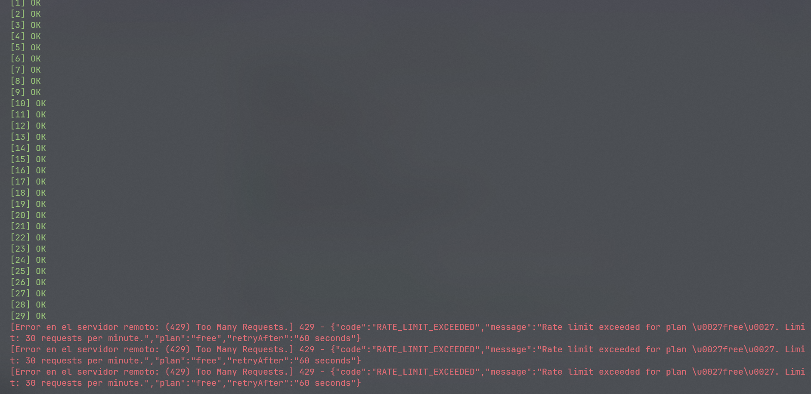

<p align="center">
  
</p>

<h1 align="center">SaqueroGateway</h1>
<p align="center">API Gateway &mdash; .NET 8 &middot; YARP &middot; JWT Validation &middot; Tenant-Aware Rate Limiting &middot; Resilience Pipeline &middot; Observability</p>

<p align="center">
  
  
  
  
  
  
  
</p>

---

## What is SaqueroGateway?

SaqueroGateway is the single entry point for the Saquero backend ecosystem.

It acts as a production-style API Gateway that validates JWT tokens, applies tenant-aware rate limiting based on subscription plan, propagates identity claims and correlation IDs across the entire call chain, and routes traffic to the correct downstream service — all before a single line of business logic runs.

This is not a CRUD. It is infrastructure that demonstrates real platform engineering thinking.

---

## Ecosystem Architecture

```text
                        Client
                           |
                           v
              +------------------------+
              |     SaqueroGateway     |  :5100
              |                        |
              |  JWT Validation        |
              |  Tenant Rate Limiting  |
              |  Claims Forwarding     |
              |  Correlation ID        |
              |  Request Logging       |
              |  Resilience Pipeline   |
              |  Error Handling        |
              +----------+-------------+
                         |
         +---------------+---------------+
         |               |               |
+--------+-------+ +-----+--------+ +----+----------+
| SaqueroCloud   | | SaqueroOrder | | SaqueroJobs   |
| :5000          | | Core :8080   | | :5200         |
| .NET 8 + React | | Java 21      | | .NET 8        |
| SaaS Platform  | | Spring Boot 3| | Job Engine    |
+----------------+ +--------------+ +---------------+
```

---

## Preview

### Gateway health check


### Downstream services monitoring with latency


### Request routed through gateway — X-Correlation-Id propagated


### Tenant-aware rate limiting in action



---

## Middleware Pipeline

```text
Request
  |
  v
ErrorHandlingMiddleware      -- uniform error contract, catches everything
  |
  v
CorrelationIdMiddleware      -- assigns X-Correlation-Id, pushes to Serilog context
  |
  v
RequestLoggingMiddleware     -- logs method, path, status, duration, correlationId
  |
  v
Authentication               -- validates JWT signature, issuer, audience, expiry
  |
  v
Authorization                -- enforces "authenticated" policy
  |
  v
RateLimiter                  -- tenant-aware: partitioned by plan+userId from JWT
  |
  v
YARP ReverseProxy
  |
  v
ClaimsForwardingMiddleware   -- forwards X-User-Id, X-User-Email, X-User-Role,
                                X-User-Plan, X-Tenant-Id, X-Forwarded-For
  |
  v
Downstream Service
```

---

## Tenant-Aware Rate Limiting

Rate limits are applied per user per plan, derived from the `plan` claim inside the JWT. No two users share the same partition.

| Plan    | Limit        | Scope          | Rejection |
| ------- | ------------ | -------------- | --------- |
| free    | 30 req/min   | Per user (JWT) | 429       |
| premium | 200 req/min  | Per user (JWT) | 429       |
| admin   | 500 req/min  | Per user (JWT) | 429       |

On rejection, the gateway returns a structured JSON response:

```json
{
  "code": "RATE_LIMIT_EXCEEDED",
  "message": "Rate limit exceeded for plan 'free'. Limit: 30 requests per minute.",
  "plan": "free",
  "retryAfter": "60 seconds"
}
```

---

## Claims Forwarding

Once a JWT is validated, the gateway extracts identity context and forwards it downstream as trusted headers.

| Header          | Source claim                        |
| --------------- | ----------------------------------- |
| X-User-Id       | sub / nameidentifier                |
| X-User-Email    | email                               |
| X-User-Role     | role                                |
| X-User-Plan     | plan / subscription (default: free) |
| X-Tenant-Id     | tenant_id / tid                     |
| X-Forwarded-For | Connection remote IP                |
| X-Correlation-Id| Generated or propagated             |

---

## Resilience Pipeline

Health check HTTP calls are backed by a resilience pipeline using Microsoft.Extensions.Http.Resilience:

| Strategy        | Configuration                                                        |
| --------------- | -------------------------------------------------------------------- |
| Retry           | 2 attempts, 200ms delay                                              |
| Circuit Breaker | Opens at 50% failure over 30s window, min 3 requests, breaks for 15s|
| Attempt Timeout | 4s per attempt                                                       |

A downstream that starts failing does not cascade into gateway slowdowns. The circuit opens and calls fail fast.

---

## Health Endpoints

`GET /health` — gateway self-check. Always 200 if the process is running.

`GET /health/downstream` — polls each downstream service independently. Always returns 200. Per-service latency and status in the response body.

```json
{
  "status": "Degraded",
  "services": [
    {
      "name": "saquero-cloud",
      "status": "Healthy",
      "description": "SaqueroCloud is reachable. Latency: 12ms",
      "latencyMs": 12,
      "statusCode": 200
    },
    {
      "name": "saquero-orders",
      "status": "Unhealthy",
      "description": "SaqueroOrderCore is unreachable after 4299ms.",
      "latencyMs": 4299,
      "statusCode": null
    }
  ]
}
```

---

## Tech Stack

| Technology                           | Version  | Role                               |
| ------------------------------------ | -------- | ---------------------------------- |
| .NET                                 | 8.0      | Runtime                            |
| C#                                   | 12       | Language                           |
| ASP.NET Core                         | 8.0      | Web framework                      |
| YARP                                 | 2.3.0    | Reverse proxy / routing            |
| JWT Bearer                           | 8.0.0    | Token validation                   |
| Serilog                              | 4.x      | Structured logging                 |
| Microsoft.Extensions.Http.Resilience | 8.0.0    | Retry + circuit breaker pipeline   |
| Rate Limiter                         | built-in | Tenant-aware fixed window per user |
| Health Checks                        | built-in | Downstream monitoring with latency |

---

## Routing

| Gateway Route                   | Destination                     | Auth |
| ------------------------------- | ------------------------------- | ---- |
| /gateway/cloud/{**catch-all}    | http://localhost:5000/{path}    | JWT  |
| /gateway/orders/{**catch-all}   | http://localhost:8080/{path}    | JWT  |
| /gateway/jobs/{**catch-all}     | http://localhost:5200/{path}    | JWT  |
| /health                         | Gateway self                    | None |
| /health/downstream              | All downstream services         | None |

---

## Getting Started

### Requirements

- .NET 8 SDK
- SaqueroCloud running on :5000 (for JWT token generation)

### Run

```bash
git clone https://github.com/Saquero/SaqueroGateway.git
cd SaqueroGateway/SaqueroGateway.Api
dotnet user-secrets set "JwtSettings:SecretKey" "your-secret-key"
dotnet run --launch-profile http
```

Gateway available at: `http://localhost:5100`

### Example Requests

```powershell
# Get a JWT token from SaqueroCloud
$token = (Invoke-RestMethod -Method POST -Uri "http://localhost:5000/api/auth/login" `
  -ContentType "application/json" `
  -Body '{"email":"admin@saquero.com","password":"Admin123!"}').token

# Route request through gateway to SaqueroCloud
Invoke-RestMethod -Uri "http://localhost:5100/gateway/cloud/api/subscription-plans" `
  -Headers @{ Authorization = "Bearer $token" }

# Route request through gateway to SaqueroOrderCore
Invoke-RestMethod -Uri "http://localhost:5100/gateway/orders/api/orders" `
  -Headers @{ Authorization = "Bearer $token" }

# Route request through gateway to SaqueroJobs
Invoke-RestMethod -Uri "http://localhost:5100/gateway/jobs/api/jobs" `
  -Headers @{ Authorization = "Bearer $token" }

# Check downstream health with latency
Invoke-RestMethod -Uri "http://localhost:5100/health/downstream"
```

---

## Key Design Decisions

**YARP over custom proxy.** Microsoft YARP is used in production .NET systems at scale. Declarative config, full middleware integration, zero boilerplate routing.

**JWT validation at the edge, never re-validated downstream.** Token issuance belongs to SaqueroCloud. The gateway validates once and forwards identity as trusted headers. This mirrors real zero-trust perimeter patterns.

**Rate limiting after auth, partitioned by user and plan.** Authenticating first means rate limits reflect real user identity, not raw IPs which are trivially spoofed. Each user gets their own partition based on their subscription tier.

**Claims forwarded inside YARP pipeline.** ClaimsForwardingMiddleware runs inside MapReverseProxy, not before it. This ensures headers are injected at the moment YARP constructs the downstream request.

**Resilience pipeline on health checks.** IHttpClientFactory with AddStandardResilienceHandler means unhealthy downstreams fail fast via circuit breaker instead of hanging threads on timeout.

**Startup validation fails fast.** Missing or empty JwtSettings throws at boot via ValidateOnStart and DataAnnotations. A gateway that starts without a signing key is a security hole, not a degraded mode.

**Health endpoint always returns 200.** A gateway returning 503 because a downstream is down confuses load balancers. The gateway is healthy, a downstream is not. Status is in the body, not the HTTP code.

**Modular startup extensions.** Each infrastructure concern is registered via a dedicated extension method: AddGatewayAuth, AddGatewayRateLimiting, AddGatewayResilience, AddGatewayHealthChecks. Program.cs is a composition root, not a god file.

---

## Project Structure

```text
SaqueroGateway.Api/
+-- Configuration/
|   +-- JwtSettings.cs                  -- strongly-typed config with DataAnnotations
+-- Extensions/
|   +-- AuthExtensions.cs               -- AddGatewayAuth
|   +-- HealthCheckExtensions.cs        -- AddGatewayHealthChecks
|   +-- RateLimitingExtensions.cs       -- AddGatewayRateLimiting
|   +-- ResilienceExtensions.cs         -- AddGatewayResilience
+-- HealthChecks/
|   +-- DownstreamHealthCheck.cs        -- IHealthCheck with latency tracking
+-- Middleware/
|   +-- CorrelationIdMiddleware.cs      -- X-Correlation-Id generation + propagation
|   +-- ErrorHandlingMiddleware.cs      -- uniform error contract
|   +-- ClaimsForwardingMiddleware.cs   -- identity headers to downstream
|   +-- RequestLoggingMiddleware.cs     -- structured request/response logging
+-- Models/
|   +-- ErrorResponse.cs               -- uniform error response record
+-- RateLimiting/
|   +-- TenantRateLimitingPolicy.cs     -- plan-based partitioned rate limiting
+-- appsettings.json                    -- YARP routes + cluster config
+-- Program.cs                          -- composition root
```

---

## Part of the Saquero Backend Ecosystem

| Project                                                         | Stack                   | Description                                            |
| --------------------------------------------------------------- | ----------------------- | ------------------------------------------------------ |
| [SaqueroCloud](https://github.com/Saquero/SaqueroCloud)         | .NET 8 + React          | SaaS admin platform, JWT auth, subscription management |
| [SaqueroOrderCore](https://github.com/Saquero/SaqueroOrderCore) | Java 21 + Spring Boot 3 | Order lifecycle backend, DDD, Hexagonal Architecture   |
| [SaqueroJobs](https://github.com/Saquero/SaqueroJobs)           | .NET 8                  | Background job processing engine                       |
| SaqueroGateway                                                  | .NET 8 + YARP           | API Gateway -- single entry point for the ecosystem    |

---

## Ecosystem Health

| Service          | Port | Health Endpoint  |
| ---------------- | ---- | ---------------- |
| SaqueroGateway   | 5100 | /health          |
| SaqueroCloud     | 5000 | /health          |
| SaqueroOrderCore | 8080 | /actuator/health |
| SaqueroJobs      | 5200 | /health          |

---

## Future Improvements

- Docker Compose for full ecosystem one-command startup
- OpenTelemetry traces with Jaeger or Zipkin
- RS256 JWT with JWKS endpoint discovery (multi-issuer support)
- Integration tests with TestContainers
- Prometheus metrics endpoint (/metrics)
- HTTPS termination at gateway level

---

See [ARCHITECTURE.md](ARCHITECTURE.md) for full design documentation.

---

<p align="center">
  <a href="https://linkedin.com/in/manusaquero">
    
  </a>
  <a href="mailto:manusaquero@gmail.com">
    
  </a>
  <a href="https://github.com/Saquero">
    
  </a>
</p>