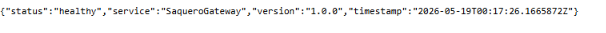
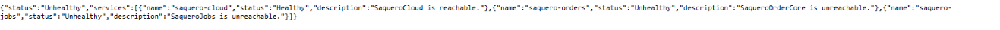
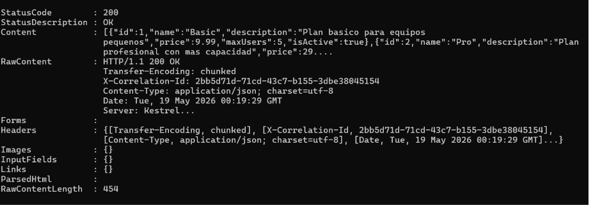

<p align="center">
  
</p>

<h1 align="center">SaqueroGateway</h1>
<p align="center">API Gateway — .NET 8 · YARP · JWT Validation · Rate Limiting · Correlation ID</p>

<p align="center">
  
  
  
  
  
</p>

---

## What is SaqueroGateway?

SaqueroGateway is the single entry point for the Saquero backend ecosystem.

It acts as a production-style API Gateway that validates JWT tokens, applies rate limiting, propagates correlation IDs, logs every request and routes traffic to the correct downstream service — all before a single line of business logic runs.

This is not a CRUD. It is infrastructure that demonstrates real system design thinking.

---

## Ecosystem Architecture

```text
                        ┌─────────────────────┐
                        │   SaqueroGateway     │
                        │   :5100              │
                        │                      │
                        │  ✓ JWT Validation    │
                        │  ✓ Rate Limiting     │
                        │  ✓ Correlation ID    │
                        │  ✓ Request Logging   │
                        │  ✓ Error Handling    │
                        └──────────┬──────────┘
                                   │
              ┌────────────────────┼────────────────────┐
              │                    │                    │
   ┌──────────▼────────┐ ┌────────▼────────┐ ┌────────▼────────┐
   │  SaqueroCloud      │ │ SaqueroOrderCore│ │  SaqueroJobs    │
   │  :5000             │ │ :8080           │ │  :5200          │
   │  .NET 8 + React    │ │ Java 21 +       │ │  .NET 8         │
   │  SaaS Platform     │ │ Spring Boot 3   │ │  Job Engine     │
   └───────────────────┘ └─────────────────┘ └─────────────────┘
```

---

## Preview

### Gateway health check



### Downstream services monitoring



### Routing request through gateway



---

## Key Design Decisions

**YARP over custom proxy.** Microsoft YARP (Yet Another Reverse Proxy) is used in production .NET systems. It provides declarative route configuration, transform pipeline, and full ASP.NET Core middleware integration — no need to reinvent routing logic.

**JWT validation only, no issuance.** The gateway validates tokens but never creates them. Token issuance is the responsibility of SaqueroCloud. This separation mirrors real microservice auth patterns.

**Correlation ID propagates across the chain.** Every request gets a `X-Correlation-Id` header — generated if absent, reused if present. It appears in logs and response headers, making distributed tracing possible without a full observability stack.

**Middleware order is intentional.** Error handling wraps everything. Correlation ID is set before logging. Rate limiting runs before auth. This order mirrors production gateway pipelines.

**Downstream health is observable.** `/health/downstream` checks all three services independently and always returns 200 with per-service status — degraded services are visible without breaking the health endpoint itself.

---

## Tech Stack

| Technology      | Version | Role                        |
| --------------- | ------- | --------------------------- |
| .NET            | 8.0     | Runtime                     |
| C#              | 12      | Language                    |
| ASP.NET Core    | 8.0     | Web framework               |
| YARP            | 2.3.0   | Reverse proxy / routing     |
| JWT Bearer      | 8.0.0   | Token validation            |
| Serilog         | 4.x     | Structured logging          |
| Rate Limiter    | built-in| Fixed window rate limiting  |
| Health Checks   | built-in| Downstream service monitoring|

---

## Routing

| Gateway Route                    | Destination                         |
| -------------------------------- | ----------------------------------- |
| `/gateway/cloud/{**catch-all}`   | `http://localhost:5000/{path}`      |
| `/gateway/orders/{**catch-all}`  | `http://localhost:8080/{path}`      |
| `/gateway/jobs/{**catch-all}`    | `http://localhost:5200/{path}`      |

All routes require a valid JWT. Public routes (`/health`, `/health/downstream`) are anonymous.

---

## API Endpoints

| Method | Endpoint               | Auth     | Description                        |
| ------ | ---------------------- | -------- | ---------------------------------- |
| GET    | /health                | None     | Gateway health check               |
| GET    | /health/downstream     | None     | All downstream services status     |
| ANY    | /gateway/cloud/**      | JWT      | Proxy to SaqueroCloud              |
| ANY    | /gateway/orders/**     | JWT      | Proxy to SaqueroOrderCore          |
| ANY    | /gateway/jobs/**       | JWT      | Proxy to SaqueroJobs               |

---

## Getting Started

### Requirements

- .NET 8 SDK
- SaqueroCloud running on :5000 (for JWT token generation)

### Run

```bash
git clone https://github.com/Saquero/SaqueroGateway.git
cd SaqueroGateway/SaqueroGateway.Api
dotnet user-secrets set "JwtSettings:SecretKey" "your-secret-key"
dotnet run --launch-profile http
```

Gateway available at: `http://localhost:5100`

Health check: `http://localhost:5100/health`

Downstream health: `http://localhost:5100/health/downstream`

### Example Requests

```powershell
# Get a JWT token from SaqueroCloud
$token = (Invoke-RestMethod -Method POST -Uri "http://localhost:5000/api/auth/login" `
  -ContentType "application/json" `
  -Body '{"email":"admin@saquero.com","password":"Admin123!"}' ).token

# Route request through gateway to SaqueroCloud
Invoke-RestMethod -Uri "http://localhost:5100/gateway/cloud/api/subscription-plans" `
  -Headers @{ Authorization = "Bearer $token" }

# Route request through gateway to SaqueroJobs
Invoke-RestMethod -Uri "http://localhost:5100/gateway/jobs/api/jobs" `
  -Headers @{ Authorization = "Bearer $token" }

# Check downstream health
Invoke-RestMethod -Uri "http://localhost:5100/health/downstream"
```

---

## Middleware Pipeline

```text
Request
  │
  â–¼
ErrorHandlingMiddleware     ← catches all unhandled exceptions
  │
  â–¼
CorrelationIdMiddleware     ← assigns X-Correlation-Id
  │
  â–¼
RequestLoggingMiddleware    ← logs method, path, status, duration
  │
  â–¼
RateLimiter                 ← 100 req/min per IP (fixed window)
  │
  â–¼
Authentication              ← validates JWT signature + claims
  │
  â–¼
Authorization               ← enforces "authenticated" policy
  │
  â–¼
YARP ReverseProxy           ← routes to downstream service
```

---

## Rate Limiting

| Policy | Limit        | Scope    | Rejection |
| ------ | ------------ | -------- | --------- |
| global | 100 req/min  | Per IP   | 429       |

---

## Part of the Saquero Backend Ecosystem

| Project                                                         | Stack                   | Description                                            |
| --------------------------------------------------------------- | ----------------------- | ------------------------------------------------------ |
| [SaqueroCloud](https://github.com/Saquero/SaqueroCloud)         | .NET 8 + React          | SaaS admin platform, JWT auth, subscription management |
| [SaqueroOrderCore](https://github.com/Saquero/SaqueroOrderCore) | Java 21 + Spring Boot 3 | Order lifecycle backend, DDD, Hexagonal                |
| [SaqueroJobs](https://github.com/Saquero/SaqueroJobs)           | .NET 8                  | Background job processing engine                       |
| SaqueroGateway                                                  | .NET 8                  | API Gateway — single entry point                       |

---

## Ecosystem Health

| Service          | Port | Health              |
| ---------------- | ---- | ------------------- |
| SaqueroGateway   | 5100 | /health ✅          |
| SaqueroCloud     | 5000 | /health ✅          |
| SaqueroOrderCore | 8080 | /actuator/health ✅ |
| SaqueroJobs      | 5200 | /health ✅          |

---

## Future Improvements

- Header propagation (X-User-Id, X-Tenant-Id) to downstream services
- Per-user rate limiting using JWT claims
- Request/response transformation pipeline
- Docker Compose for full ecosystem
- Integration tests with TestContainers
- Prometheus metrics endpoint

---

<p align="center">
  <a href="https://linkedin.com/in/manusaquero">
    
  </a>
  <a href="mailto:manusaquero@gmail.com">
    
  </a>
  <a href="https://github.com/Saquero">
    
  </a>
</p>
